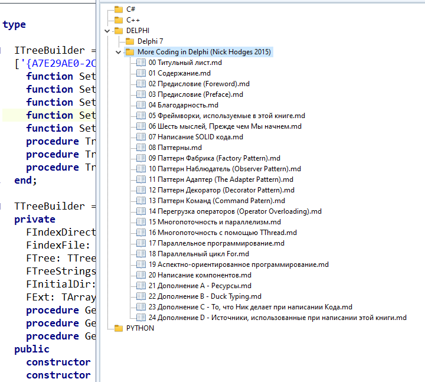

### Модуль uTreeDirectoryIntf.pas для создания дерева директории с файлами



## **Интерфейс ITReeBuilder**

Это интерфейс который строит Дерево из каталогов и файлов из указанной директории. 

#### **Основные функции:**
* построение дерева в компоненте TTreeView
* построение дерева в текстовом формате с отступами
* построение списка дерева с полными путями файлов
* фильтрация по расширениям файлов
* поддержка управления иконками дерева для TTreeView 

### 🛠 **Основные Методы** 

* **procedure TreeExecut** - строит дерево только для TTreeView  
* **procedure TreeListExecut**  - строит дерево только для TStrings  
* **procedure TreeFullPathListExecut** - строит дерево только для TStrings выводит просто список с полными путями файлов  
Ко всем трем методам можно применять фильтр с расширениями файлов.

Результат вывода в TStrings метода **TreeListExecut** совместим для экспорта в компонент TTReeView т.е. текстовое дерево можно импортировать в класс TTreeView   
**Пример экспорта:**
```pascal
// Импорт дерева файлов из TMemo.Lines в TTreeView         
  var mstrm := TMemoryStream.Create;
  try
	 // mmReport - Класс TMemo со встроенным классом Lines: TStrings
	 mmReport.Lines.SaveToStream(mstrm); 
	 mstrm.Position := 0;
	 TVBooks.LoadFromStream(mstm); // TVBooks - это класс TTreeView
  finally
	 mstrm.Free;
  end;
```   

### 🛠 **Методы - параметры** 

*  **function SetInitialDir(const InitialDir: string): ITReeBuilder;**  - Задает начальный каталог откуда строится дерево 
* **function SetTree(Tree: TTreeView): ITReeBuilder;** - Задает компонент TTreeView в котором строится дерево   
* **function SetTreeStrings(TreeStrings: TStrings): ITReeBuilder;** - Задает класс TStrings в котором строится дерево в текстовом формате.
*  **function SetFilterFileExt(const AExt: TArray<string>): ITReeBuilder;** - задает массив с расширениями для фильтрации файлов, если массив пустой в нем 0 элементов, то фильтр не применяется. 
* **function SetIndexIcons(const IndexDir, indexFile: Integer): ITReeBuilder;** - метод задает индексы иконок для директорий и файлов. Если индексы иконок не задавались, от они по умолчанию не отображаются
Поддерживается отображение иконок двух типов: директорий, файлов. Поддерживается только одно изображение на все типы директорий и одно изображение на все типы файлов. Иконки нужно подбирать самостоятельно в компоненте TImageList с добавлением этого списка в компонент TTreeView через свойство **images**, например, **MyTreeView.images := MyImageList;**
  
🛠 **Примеры использования / Use Examples:**
```pascal
  // Строим дерево в компоненте TTreeView
  // Создание объекта интерфейса через "New" 
  // Здесь не явный вызов конструктора

  // выполнение без переменной для интерфейса
  // (Однократное выполнение)
  TTreeBuilder.New.SetTree(TVBooks)
              .SetIndexIcons(0, 1)
              .SetInitialDir(FBooksDir)
              .SetFilterFileExt(['.md'])
              .TreeExecut;

  // выполнение с использованием переменной
  var ITreeOne := TTreeBuilder.New.SetTree(TVBooks)
                 .SetIndexIcons(0, 1)
                 .SetInitialDir(MainConf.BooksDir)
                 .SetFilterFileExt(['.md', '.txt']);
  ITreeOne.TreeExecut;

  // Продолжаем, теперь построение дерева в TStrings
  ITreeOne.SetTreeStrings(mmReport.Lines).TreeListExecut;

  // Продолжаем, теперь построение списка дерева с полными путями в TStrinhgs
  ITreeOne.TreeFullPathListExecut;

  // Явное использование вызова конструктора (классическое)
  // их два с параметрами и без
  // Не забываем, что это интерфейс и обязательно указываем тип переменной на интерфейс, 
  // что бы не было утечки памяти
  var ITreeTwo: ITreeFiles := TTreeFiles.Create(TVBooks, nil, MainConf.BooksDir);
  ITreeTwo.TreeExecut;
  ```

* Telegram channel: https://t.me/delphi_solutions
* Telegram chat: https://t.me/delphi_solutions_chat
* Telegram video: https://t.me/delphi_solutions_video
* DONATE ME  https://t.me/delphi_solutions_donate
